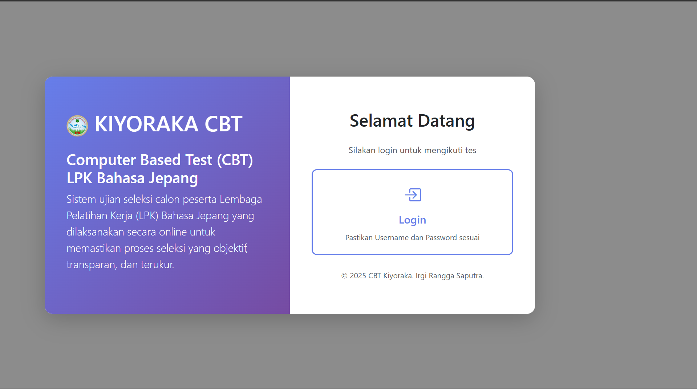
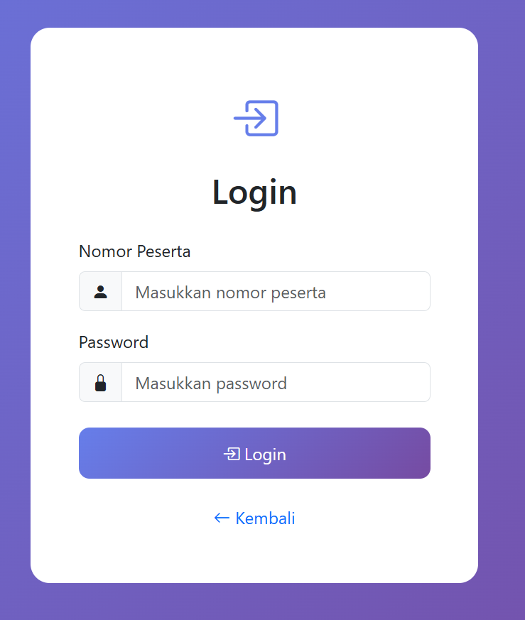
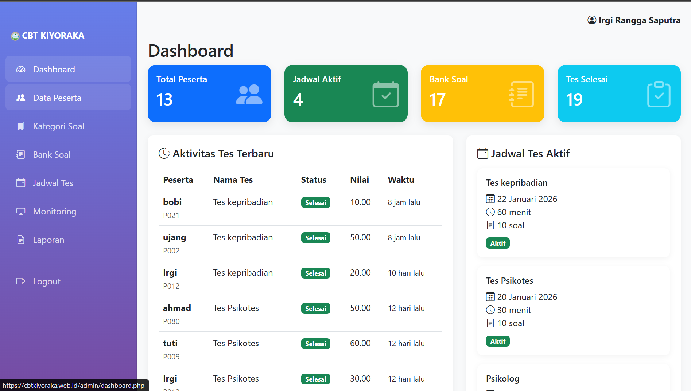
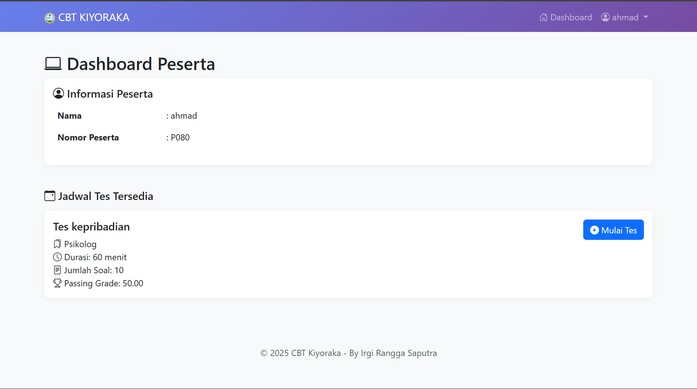
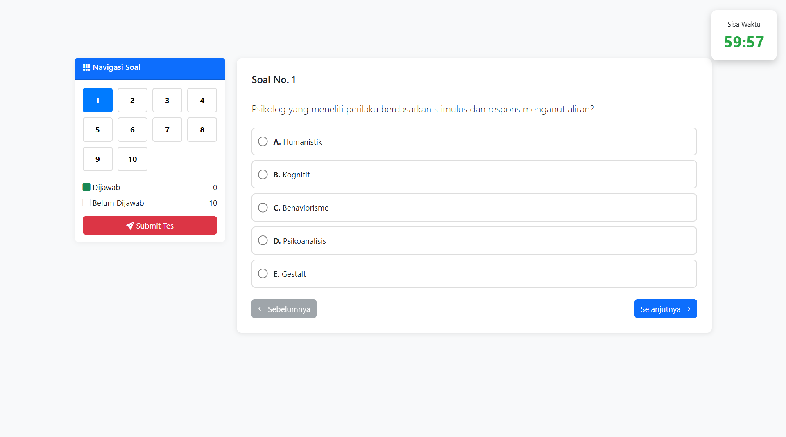
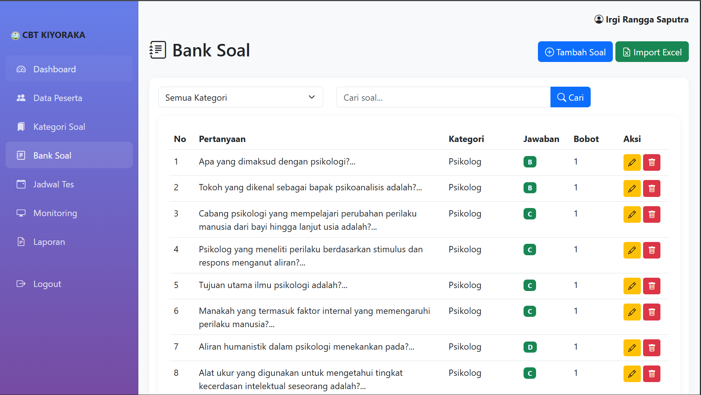
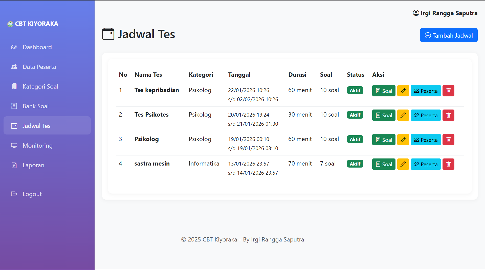
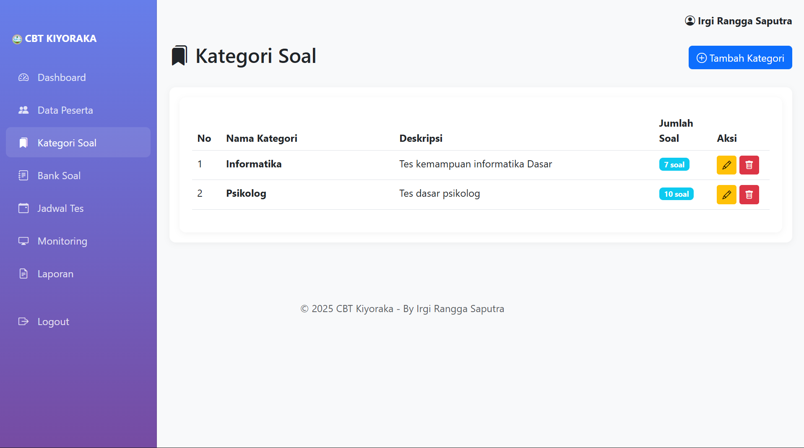
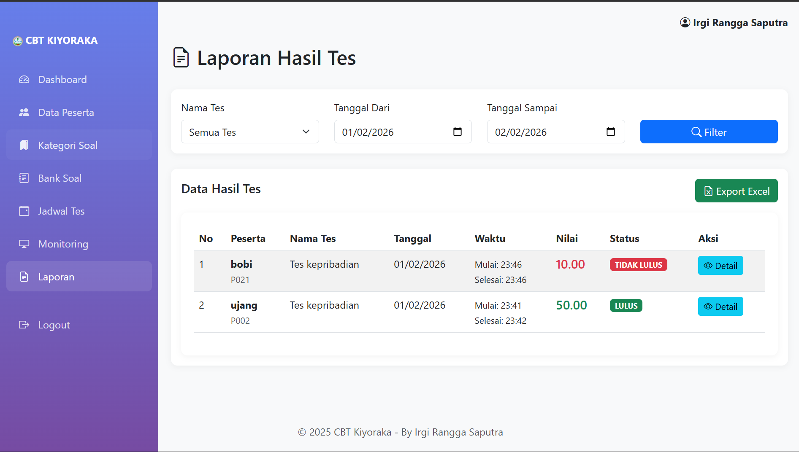
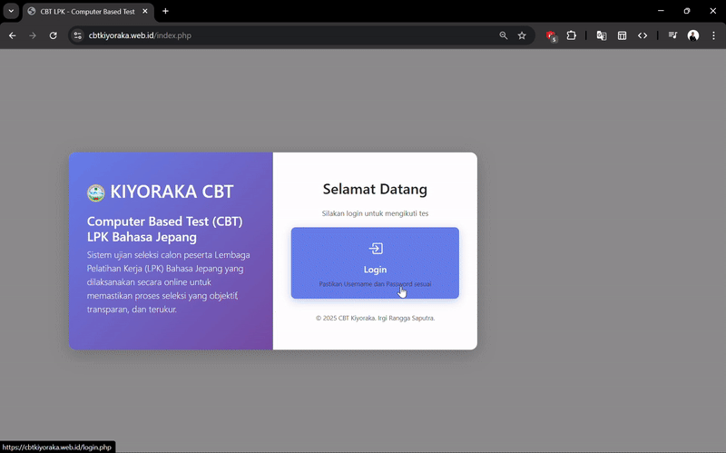

# CBT KIYORAKA - Computer Based Test System
**Sistem Ujian Online Terintegrasi untuk Lembaga Pelatihan Kerja**

> Aplikasi web modern untuk mengelola ujian berbasis komputer dengan fitur monitoring real-time, penilaian otomatis, dan laporan terperinci.

---

## Project Information

| Aspek | Detail |
|-------|--------|
| **Nama Project** | CBT KIYORAKA (Computer Based Test) |
| **Tujuan** | Sistem ujian online untuk LPK |
| **Teknologi** | PHP, MySQL, HTML5, CSS3, Bootstrap 5, JavaScript |
| **Database** | MySQL 5.7+ |
| **Server** | Apache/Nginx dengan PHP 7.4+ |
| **Framework** | Native PHP (No Framework) |
| **License** | Open Source |

---

##  Deskripsi Project

CBT KIYORAKA adalah aplikasi web yang dirancang untuk mengelola proses testing/ujian secara online bagi peserta pelatihan kerja. Sistem ini menyediakan interface yang user-friendly untuk peserta mengerjakan soal dan dashboard lengkap untuk administrator mengelola seluruh aspek testing.

### Use Case
- Lembaga Pelatihan Kerja (LPK)
- Sekolah Kejuruan
- Pusat Pelatihan Profesional
- Platform E-Learning dengan sistem testing

---

## Fitur Utama

### Fitur Administrator
✅ **Dashboard Statistik**
- Ringkasan jumlah peserta, jadwal tes, bank soal
- Statistik hasil tes (lulus/tidak lulus)
- Monitoring real-time peserta yang sedang mengerjakan

✅ **Manajemen Peserta (CRUD)**
- Tambah, edit, hapus data peserta
- Import peserta dari file Excel/CSV
- Kelola status peserta (aktif/non-aktif)

✅ **Manajemen Soal (CRUD)**
- Buat kategori soal
- Tambah, edit, hapus soal dengan pilihan ganda (A-E)
- Upload gambar untuk soal
- Import soal dari Excel/CSV

✅ **Manajemen Jadwal Tes**
- Buat jadwal tes dengan konfigurasi waktu
- Kelola peserta per jadwal
- Tentukan soal yang digunakan per jadwal
- Set passing grade dan durasi tes

✅ **Monitoring & Laporan**
- Monitor peserta yang sedang mengerjakan tes
- Export hasil tes ke Excel
- Laporan detail per peserta dengan jawaban benar/salah
- Print laporan dalam format PDF

### Fitur Peserta
✅ **Authentication**
- Login dengan nomor peserta dan password
- Password terenkripsi dengan bcrypt
- Session management yang aman

✅ **Dashboard**
- Melihat jadwal tes yang tersedia
- Melihat hasil tes yang sudah dikerjakan
- Status kelulusan (Lulus/Tidak Lulus)

✅ **Mengerjakan Tes**
- Interface tes yang clean dan intuitif
- Timer countdown otomatis
- Autosave jawaban real-time
- Navigasi antar soal yang mudah
- Indikator soal sudah/belum dijawab

✅ **Fitur Keamanan Tes**
- Auto-submit ketika waktu habis
- Prevent back button
- Session validation
- Proteksi akses langsung ke tes

---

## Screenshots & Demo

### Screenshots

**Landing Page** - Informasi Aplikasi



**Login Page** - Interface login yang clean dan responsif




**Admin Dashboard** - Ringkasan Informasi 



**Peserta Dashboard** - Daftar jadwal Bagi Peserta



**Petunjuk Test** - Informasi Petunjuk Pelaksanaan Tes


**Test Interface** - Interface mengerjakan soal dengan timer



**Bank Soal** - Daftar Bank Soal



**Monitoring** - Monitoring pengerjaan Untuk Admin


**Jadwal Tes** - Jadwal Test Untuk Admin Membuka Jadwal



**Kategori Soal** 



**Laporan** - Laporan Untuk Admin Memudahkan Report 



### Video Demonstrasi



## Tech Stack

### Backend
```
- PHP 7.4+
- MySQL 5.7+
- Session Management
- MySQLi (Prepared Statements)
```

### Frontend
```
- HTML5
- CSS3
- Bootstrap 5.3.0
- JavaScript (Vanilla)
- jQuery 3.6.0
- Bootstrap Icons
```

### Security
```
- Password Hashing (bcrypt)
- SQL Injection Prevention (Prepared Statements)
- XSS Protection
- Session Validation
- CSRF Token (Built-in PHP)
```
---

## User Manual

### Untuk Administrator

**Login & Dashboard**
1. Akses https://cbtkiyoraka.web.id
2. Masukkan username dan password admin
3. Lihat dashboard dengan statistik lengkap

**Mengelola Peserta**
1. Pilih menu "Peserta"
2. Klik "Tambah Peserta" untuk tambah baru
3. Isi data peserta (nomor peserta, nama, password)
4. Atau gunakan "Import Peserta" untuk bulk import dari Excel

**Mengelola Soal**
1. Pilih menu "Bank Soal"
2. Buat kategori soal terlebih dahulu
3. Tambah soal baru dengan:
   - Pertanyaan/Pertanyaan
   - Pilihan A-E
   - Jawaban benar
   - Bobot poin
   - Upload gambar (optional)

**Membuat Jadwal Tes**
1. Pilih menu "Jadwal Tes"
2. Klik "Tambah Jadwal"
3. Atur:
   - Nama tes
   - Tanggal mulai & akhir
   - Durasi (dalam menit)
   - Passing grade
4. Kelola peserta dan soal untuk jadwal tersebut

**Monitoring & Laporan**
1. Menu "Monitoring" - lihat peserta yang sedang tes real-time
2. Menu "Laporan" - lihat hasil tes semua peserta
3. Klik detail untuk melihat jawaban detail per peserta
4. Export ke Excel atau Print PDF

### Untuk Peserta

**Login**
1. Akses https://cbtkiyoraka.web.id
2. Masukkan nomor peserta dan password
3. Klik "Login"

**Dashboard Peserta**
1. Lihat jadwal tes yang tersedia
2. Lihat hasil tes yang sudah dikerjakan
3. Lihat status kelulusan (Lulus/Tidak Lulus)

**Mengerjakan Tes**
1. Klik "Mulai Tes" pada jadwal yang diinginkan
2. Baca instruksi test dan klik "Mulai"
3. Lihat soal dan jawab pilihan ganda A-E
4. Timer countdown akan berjalan otomatis
5. Navigasi antar soal dengan klik nomer soal atau Next/Prev
6. Jawaban otomatis tersimpan (autosave)
7. Klik "Submit Tes" untuk menyelesaikan
8. Lihat hasil di dashboard

---

## Project Structure

```
CBT-Web/
├── admin/                          # Admin Module
│   ├── dashboard.php               # Admin Dashboard
│   ├── peserta.php                 # Kelola Peserta (CRUD)
│   ├── peserta_add.php             # Tambah Peserta
│   ├── peserta_edit.php            # Edit Peserta
│   ├── peserta_import.php          # Import Peserta dari Excel
│   ├── bank_soal.php               # Kelola Soal (CRUD)
│   ├── bank_soal_add.php           # Tambah Soal
│   ├── bank_soal_edit.php          # Edit Soal
│   ├── bank_soal_import.php        # Import Soal dari Excel
│   ├── kategori_soal.php           # Kelola Kategori Soal
│   ├── jadwal_tes.php              # Kelola Jadwal Tes
│   ├── jadwal_tes_add.php          # Tambah Jadwal Tes
│   ├── jadwal_tes_edit.php         # Edit Jadwal Tes
│   ├── jadwal_tes_peserta.php      # Peserta per Jadwal
│   ├── jadwal_tes_soal.php         # Soal per Jadwal
│   ├── monitoring.php              # Monitoring Real-time
│   ├── laporan.php                 # Laporan Hasil Tes
│   ├── laporan_detail.php          # Detail Hasil Peserta
│   ├── laporan_export_detail.php   # Export ke Excel
│   ├── laporan_print_detail.php    # Print PDF
│   ├── logout.php                  # Logout
│   └── includes/
│       ├── header.php              # Template Header Admin
│       └── footer.php              # Template Footer Admin
│
├── peserta/                        # Peserta Module
│   ├── dashboard.php               # Dashboard Peserta
│   ├── profile.php                 # Profil Peserta
│   ├── tes_mulai.php               # Interface Testing
│   ├── tes_petunjuk.php            # Instruksi Test
│   ├── tes_save.php                # API Autosave
│   ├── tes_submit.php              # API Submit Tes
│   ├── logout.php                  # Logout
│   └── includes/
│       ├── header.php              # Template Header Peserta
│       └── footer.php              # Template Footer Peserta
│
├── api/                            # API Endpoints
│   ├── jawaban/
│   │   └── save.php                # Save Jawaban
│   ├── peserta/
│   │   ├── dashboard.php
│   │   ├── logout.php
│   │   └── profile.php
│   ├── tes/
│   │   ├── detail.php
│   │   ├── start.php
│   │   └── submit.php
│   └── ...
│
├── assets/                         # Static Files
│   ├── css/                        # Stylesheets
│   │   ├── admin.css
│   │   ├── peserta.css
│   │   ├── auth.css
│   │   └── landing.css
│   ├── image/                      # Images & Logo
│   │   └── kiyoraka.png
│   └── uploads/                    # User Uploads (Soal Images)
│
├── config/                         # Configuration
│   └── .gitignore
│
├── vendor/                         # Composer Dependencies
│   └── ...
│
├── config.php                      # Database Configuration
├── index.php                       # Homepage
├── login.php                       # Login Page
├── database.sql                    # Database Schema
├── .htaccess                       # Apache Configuration
├── composer.json                   # PHP Dependencies
├── composer.lock                   # Dependency Lock
└── README.md                       # Documentation
```

---

## Database Schema

### Tables Overview

| Table | Purpose |
|-------|---------|
| **admin** | Data administrator system |
| **peserta** | Data peserta/student |
| **kategori_soal** | Kategori atau topik soal |
| **bank_soal** | Semua soal yang tersedia |
| **jadwal_tes** | Jadwal dan setting tes |
| **jadwal_tes_peserta** | Relasi peserta dengan jadwal tes |
| **jadwal_tes_soal** | Soal yang digunakan dalam tes |
| **jawaban_peserta** | Jawaban yang diberikan peserta |

---

## Security Features

✅ **Authentication & Authorization**
- Role-based access control (Admin/Peserta)
- Session validation pada setiap request
- Auto-logout jika session expired
- Login attempt limiting

✅ **Password Security**
- Password hashing dengan bcrypt
- Password tidak disimpan plain text
- Minimum password requirements

✅ **SQL Injection Prevention**
- Menggunakan Prepared Statements
- MySQLi untuk safe queries
- Input sanitization

✅ **XSS (Cross-Site Scripting) Prevention**
- Output escaping dengan htmlspecialchars()
- Input validation
- Content Security Policy ready

✅ **Session Management**
- Secure session handling
- HTTPS ready (untuk production)
- Session timeout configuration

✅ **Test Security**
- Prevent back button during test
- Session validation per question
- Auto-submit ketika waktu habis
- Proteksi direct access ke test interface

---

## Developer Information

**Nama:** Irgi Rangga Saputra  
**NPM:** 23552011343  
**Universitas:** Universitas Teknologi Bandung  
**Departemen:** Departemen Teknik Informatika  

---

## License & Credits

Proyek ini merupakan hasil pengembangan untuk memenuhi syarat Ujian Akhir Semester mata kuliah **Web Development 1** di **Universitas Teknologi Bandung**.

**© 2025 CBT Kiyoraka. By Irgi Rangga Saputra**
